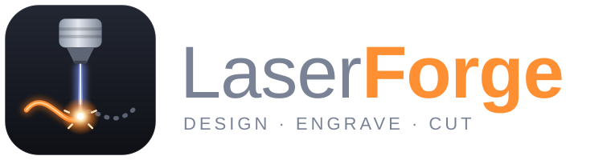

<p align="center"></p>

# A·S·D Lasercraft

A Windows design-and-burn app for **GRBL diode lasers** (xTool, Atomstack, Sculpfun, Ortur, Two Trees, NEJE and similar). Draw or import artwork, assign it to layers with their own speed and power, frame the job to check size and placement, then stream it to the laser over USB.

> **Status: v0.1 scaffold.** The core engine (G-code generation, dithering, GRBL streaming, SVG import) is unit-tested. The WPF front end is a working first cut. Test on scrap material first.

## Features

| Feature | How it works |
|---|---|
| **Normal engraving** | `Fill` layers scan-line hatch closed shapes (even-odd rule, so holes in letters stay open). Line interval sets resolution. |
| **Cutting** | `Line` layers trace outlines, with multiple passes. Inner shapes are cut before the shapes around them, and travel is minimised. |
| **Image engraving** | `Image` layers raster bitmaps. Modes: Jarvis, Stucki, Floyd–Steinberg, Atkinson, threshold, or true grayscale (variable power). Brightness, contrast, gamma and invert are adjustable. Optional raster preview shows the exact dots that will burn. |
| **Vector drawing / editing** | Rectangle, ellipse, polygon, line and pen tools. Select, move, resize with handles, rotate, mirror, duplicate, align. Snap to grid. Undo/redo. |
| **Text & shapes** | Any installed Windows font is converted to outlines. SVG import (paths, arcs, curves, groups, transforms, real-world units). |
| **Layers with their own settings** | Each layer has its own mode, speed, power, passes, line interval, overscan, bidirectional scanning, min power and air assist (M8). Layers burn top-to-bottom. |
| **Test sizing before burn** | **Frame** traces the job's bounding box with the laser off, or at a capped 1–5 % pointer power. **Material test grid** generates a labelled speed × power matrix. |
| **Resize images, etc.** | Drag handles or type exact X/Y/W/H in mm, with aspect lock. Images rotate in 90° steps and mirror. |
| **Machine control** | COM port connect, home ($H), unlock ($X), set work origin, jog pad, pause/resume (feed hold), emergency stop (soft reset), live head position, console for raw GRBL commands, G-code export. |

## Project layout

```
AsdLasercraft.sln
├─ src/AsdLasercraft.Core      Pure .NET 8 engine, no UI or package dependencies
│   ├─ Geometry             Vec2, Bounds, Polyline, Transform2D, curve/arc flattening
│   ├─ Model                LaserProject, Layer, VectorShape, ImageShape, ShapeFactory, MachineProfile
│   ├─ Imaging              Adjust → resample to line interval → dither
│   ├─ Gcode                GcodeGenerator (line / fill / raster / frame), scan-line fill, path ordering
│   ├─ Grbl                 Character-counting streamer, status parser, error codes
│   ├─ Import               SVG importer
│   ├─ Generators           Material test grid, seven-segment label font
│   └─ Serialization        .asdl JSON project files, snapshot undo/redo
├─ src/AsdLasercraft.App       WPF front end (Windows only)
│   ├─ Controls/DesignCanvas.cs   Zoom/pan work area, selection, drawing tools
│   ├─ Services                   Serial port, image loading, text-to-outline
│   └─ MainWindow.xaml(.cs)       Menus, layers panel, properties, laser control
└─ tests/AsdLasercraft.Core.Tests    Dependency-free test runner (29 tests)
```

## Build and run

You need Windows 10/11 and the [.NET 8 SDK](https://dotnet.microsoft.com/download/dotnet/8.0). Visual Studio 2022 (with the ".NET desktop development" workload) or JetBrains Rider work well.

```powershell
git clone <this repo>
cd LaserForge   # repo folder
dotnet run --project src/AsdLasercraft.App            # run the app
dotnet run --project tests/AsdLasercraft.Core.Tests   # run the engine tests
```

Each push to `main` is built on GitHub Actions. A self-contained `AsdLasercraft.exe` is published as a build artifact, with no .NET install needed.

## Setting up your laser

A·S·D Lasercraft assumes **GRBL 1.1 in laser mode**. Check these settings once from the Laser tab console (send `$$` to list them):

| Setting | Meaning | Typical value |
|---|---|---|
| `$32=1` | Laser mode. The laser turns off during rapid moves and pauses, and power follows motion. **Required.** | 1 |
| `$30` | S value for 100 % power. Must match *Tools → Machine settings → Max S*. | 1000 (some boards 255) |
| `$130` / `$131` | Bed size in mm. Set the same in Machine settings. | e.g. 400 |
| `$22` | Homing enabled. If 0, use **Set work origin here** instead of Home. | 1 |

Coordinates: the canvas uses a top-left origin, like the screen. Most diode lasers home to the **front-left**, so Y is flipped on output by default. If your laser homes to the back-left, untick *Origin front-left* in Machine settings.

## Typical workflow

1. **Tools → Material test grid** on a scrap of your material. Pick the cell that looks best.
2. Draw or import artwork. Put engraving on a `Fill` or `Image` layer and cut lines on a `Line` layer at the **bottom** of the list, so cuts happen last.
3. Set speed, power and passes per layer in the layers table.
4. Connect → Home → **Frame** to check placement → **Start**.

Shortcuts: `V` select, `R` rectangle, `E` ellipse, `G` polygon, `L` line, `P` pen (Enter or double-click finishes, click the first point to close), `T` text, `F` zoom to fit, arrows nudge 1 mm (Shift 10 mm, Ctrl 0.1 mm), `Ctrl+D` duplicate, `Ctrl+Z`/`Ctrl+Y` undo/redo, `Esc` cancel. Hold Shift to draw squares and circles, Alt to disable snapping, and Space or middle-drag to pan.

## Safety

Lasers start fires and cause permanent eye damage. Always wear safety glasses rated for your laser's wavelength (typically 445–455 nm for diodes). Never leave a running job unattended, and keep an extinguisher within reach. **Stop** sends a feed hold followed by a GRBL soft reset, which kills the beam immediately. It does not replace your machine's physical emergency stop.

## Versioning

The version is set once in `Directory.Build.props` (`VersionPrefix`). CI stamps each build with its run number and commit, so **Help → About** shows something like `0.2.0 (build 12, a1b2c3d)`. Generated G-code files record the version in their header. Changes are listed in [CHANGELOG.md](CHANGELOG.md).

## Author

**Alastair Stewart Duncan** – [alastair@aduncan.co.uk](mailto:alastair@aduncan.co.uk)

© 2026 Alastair Stewart Duncan. All rights reserved.

## Roadmap ideas

- Offsets/kerf compensation, boolean ops (union, difference) and tabs for cutting
- Rotary attachment support
- Camera overlay for positioning on the material
- DXF and PDF import, and a node editor for vectors
- Per-machine profiles and a material library
- Ruida/CO₂ support behind the existing `ILineTransport` / generator abstractions
